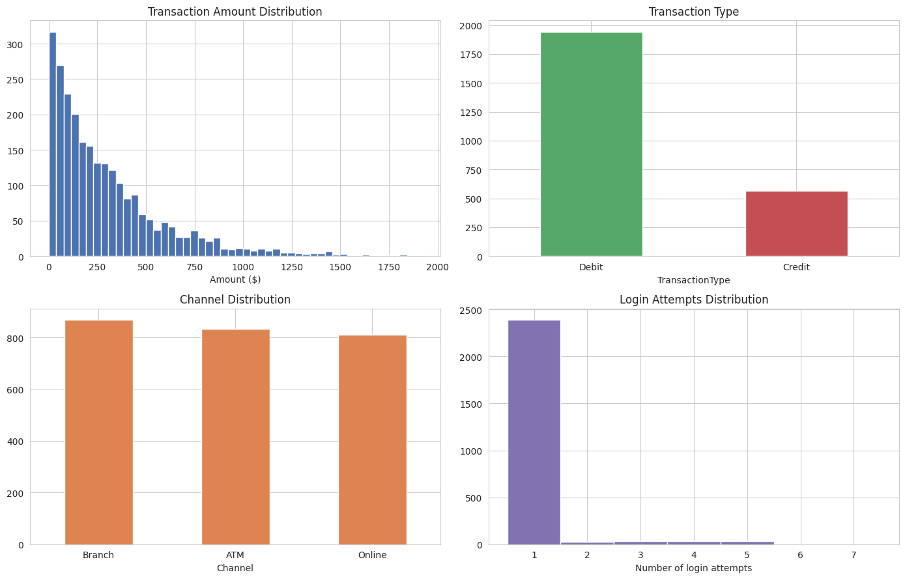
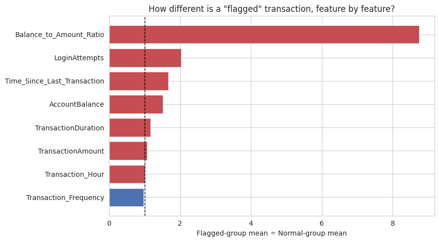
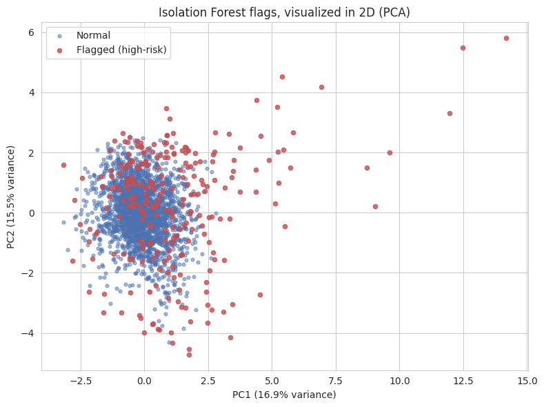
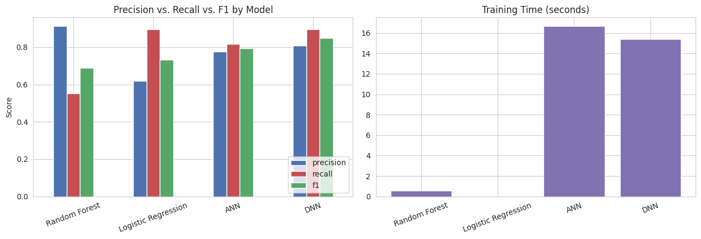
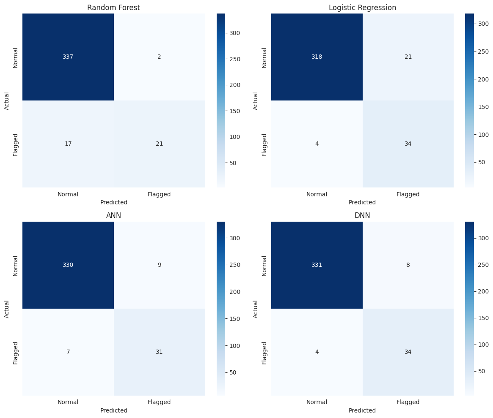
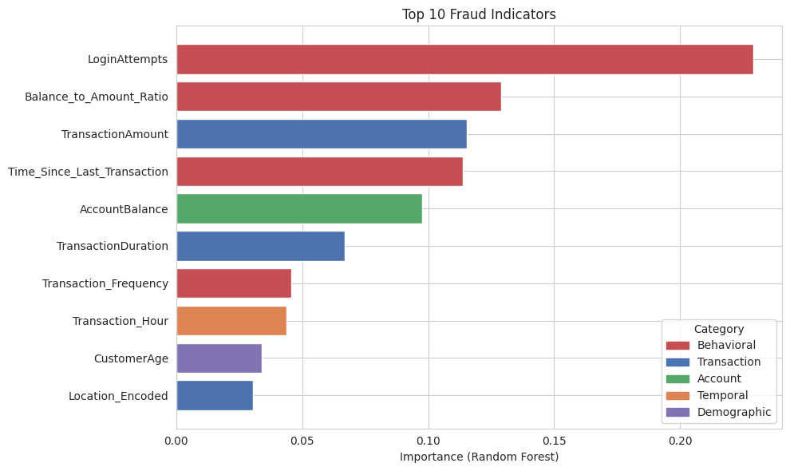
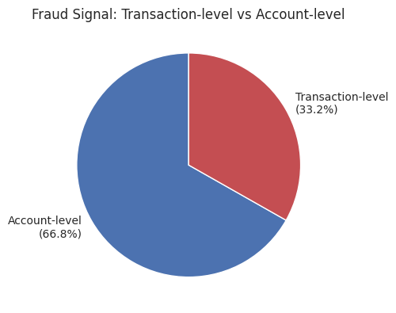
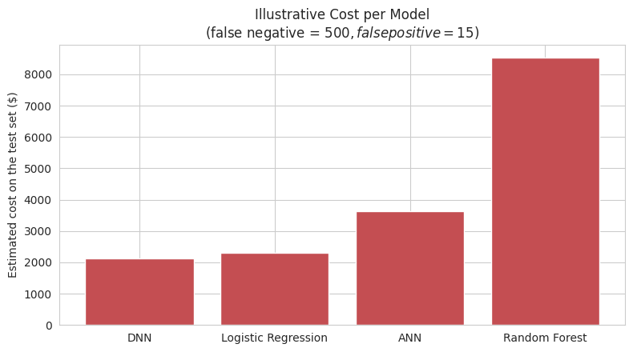

# 🏦 Bank Transaction Fraud Detection

A fraud detection system for unlabeled bank transaction data. Since no fraud labels exist in the source dataset, the project uses an **unsupervised-to-supervised hybrid pipeline**: clustering algorithms (K-Means, Isolation Forest) first generate a working proxy label by identifying anomalous transactions, and that label is then used to train and compare four supervised models  two classical Machine Learning models and two Deep Learning models.

## Table of Contents

1. [Background](#1-background)
2. [Business Questions](#2-business-questions)
3. [Dataset](#3-dataset)
4. [Methodology](#4-methodology)
   - 4.1 [Models](#41-models)
5. [Tools](#5-tools)
6. [Insight](#6-insight)
   - 6.1 [Model Performance](#61-model-performance)
   - 6.2 [Top Fraud-Indicating Features](#62-top-fraud-indicating-features)
   - 6.3 [Cost of Getting It Wrong](#63-cost-of-getting-it-wrong)
   - 6.4 [Real-Time Feasibility](#64-real-time-feasibility)
   - 6.5 [Key Takeaways](#65-key-takeaways)
7. [Recommendations](#7-recommendations)
8. [Conclusion](#8-conclusion)
9. [Limitations](#9-limitations)
10. [Creator](#10-creator)

---

## 1. Background

Digital banking has made transactions faster and more convenient, but it has also opened the door to more sophisticated fraud. Every fraudulent transaction that slips through represents a direct financial loss to the bank, and repeated incidents chip away at something harder to recover: customer trust. Once customers feel their money isn't safe, they move to a competitor.

The bank's current defenses rely mainly on fixed rules  flagging a transaction only when it breaks a predefined threshold. This works against obvious, known fraud patterns, but sophisticated fraudsters adapt quickly and learn to stay just under the radar. Making matters harder, the bank doesn't have a historical record of which past transactions were actually fraudulent, so there is no simple "answer key" to learn from. Any solution has to start by working out which transactions look suspicious before it can be trained to catch them going forward.

Left unresolved, this gap carries real business cost: losses that can run into the billions of rupiah, reputational damage, exposure to regulatory scrutiny, and investigation teams stretched thin manually reviewing transactions that a smarter system could triage automatically.

---

## 2. Business Questions

- **Where is the bank most exposed?** Which types of transactions, customers, or channels carry the highest fraud risk right now?
- **Can we trust an automated system to make the call?** How confident can the bank be that a system trained without historical fraud records is actually flagging the right transactions  and not just unusual-but-legitimate customer behavior?
- **What should the fraud team actually watch for?** Which customer or transaction signals are the strongest early warning signs, so investigators know where to focus their limited time?
- **What's the cost of getting it wrong?** How do we balance catching more fraud against the risk of blocking or annoying legitimate customers with false alarms?
- **Can this scale to real operations?** Is the approach fast and reliable enough to support real-time decisions, rather than only after-the-fact analysis?

---

## 3. Dataset

**Source:** [Kaggle  Bank Transaction Dataset for Fraud Detection](https://www.kaggle.com/datasets/valakhorasani/bank-transaction-dataset-for-fraud-detection)

| Stat | Value |
|---|---|
| Samples | 2,512 transactions |
| Features | 16 columns, no missing values |
| Transaction amount | $0.26 – $1,919.11 (mean ≈ $298) |
| Customer age | 18 – 80 years (mean ≈ 45) |
| Login attempts | 1 – 5 per transaction (95 transactions with 3+ attempts, 3.8% of the data) |
| Channels | Online, ATM, Branch |
| Time period | January 2023 – January 2024 |

| Feature | Description |
|---|---|
| `TransactionID` | Unique transaction identifier |
| `AccountID` | Unique account identifier |
| `TransactionAmount` | Monetary value of the transaction |
| `TransactionDate` | Timestamp of the transaction |
| `TransactionType` | Credit or Debit |
| `Location` | U.S. city of the transaction |
| `DeviceID` | Device used for the transaction |
| `IP Address` | IPv4 address |
| `MerchantID` | Merchant identifier |
| `AccountBalance` | Post-transaction balance |
| `PreviousTransactionDate` | Timestamp of the previous transaction |
| `Channel` | Transaction channel |
| `CustomerAge` | Age of the account holder |
| `CustomerOccupation` | Occupation of the account holder |
| `TransactionDuration` | Duration in seconds |
| `LoginAttempts` | Number of login attempts |

> **Data quality note:** `PreviousTransactionDate` turned out not to be a genuine per-account transaction history field, so it was replaced with a `Time_Since_Last_Transaction` feature computed directly from each account's own sorted transaction records.

---

## 4. Methodology

**Step 1  Data preprocessing**  Timestamps parsed, data checked for missing values (none found) and outliers, and a corrected time-since-last-transaction computed per account.

**Step 2  Feature engineering**

| Category | Features |
|---|---|
| Temporal | `Transaction_Hour`, `Transaction_Day`, `Transaction_Month`, `Transaction_DayOfWeek` |
| Behavioral | `Time_Since_Last_Transaction`, `Transaction_Frequency`, `Balance_to_Amount_Ratio` |
| Encoded | Label-encoded categorical variables (`TransactionType`, `Location`, `Channel`, `CustomerOccupation`) |

Two feature sets are used for two different jobs: an 8-feature **behavioral-only** set for clustering, and the full 16-feature set (behavioral + demographic + encoded categoricals) for the supervised models.

**Step 3  Clustering for label generation**
- **K-Means** (`n_clusters=2`) was first tried on the *full* feature set (including demographics)  this failed the business-sense test, since the split mainly tracked `CustomerOccupation` and `CustomerAge` rather than fraud behavior (silhouette score 0.099).
- Restricting K-Means to **behavioral-only features** fixed this: silhouette score jumped to 0.439, and the split was now driven almost entirely by `LoginAttempts`, flagging 95 transactions as high-risk.
- **Isolation Forest** (`contamination=0.1`) was then run on the same behavioral features as the primary anomaly detector, flagging the 252 transactions (10.0% of the dataset) that are easiest to isolate.
- Cross-checking the two methods: Cohen's kappa of 0.448 (moderate, chance-corrected agreement), and **87% of the transactions K-Means flagged were independently also flagged by Isolation Forest**  real evidence the working label is behaviorally grounded, not arbitrary.
- **Isolation Forest on behavioral features** was adopted as the working proxy label for all downstream modeling, with the explicit caveat that it remains a proxy, not confirmed ground truth.

**Step 4  Model training**  Data is split 70% train (1,759) / 15% validation (376) / 15% test (377) using stratified sampling, preserving a ~10% positive rate across all three splits.

### 4.1 Models

| Model | Type | Notes |
|---|---|---|
| Random Forest (100 trees) | Machine Learning | Robust to overfitting, handles non-linear relationships, provides feature importance; evaluated with 5-fold CV |
| Logistic Regression (L2, max_iter=1000) | Machine Learning | Fast, interpretable baseline; evaluated with 5-fold CV |
| ANN (4 hidden layers: 128→64→32→16) | Deep Learning | ReLU + BatchNorm + Dropout per layer, sigmoid output, Adam optimizer, binary cross-entropy loss, class weighting (~9x on the minority class), early stopping (patience=10), batch size 32 |
| DNN (5 hidden layers: 256→128→64→32→16) | Deep Learning | Deeper architecture with higher dropout in early layers for more complex pattern recognition |

---

## 5. Tools

| Category | Tools / Libraries |
|---|---|
| Language | Python 3.8+ |
| Data handling | pandas, numpy |
| Visualization | matplotlib, seaborn |
| Classical ML | scikit-learn (KMeans, IsolationForest, RandomForestClassifier, LogisticRegression) |
| Deep Learning | TensorFlow/Keras |
| Environment | Jupyter Notebook |

---

## 6. Insight

### 6.1 Model Performance

On the held-out test set (377 transactions):

| Model | Test Accuracy | Precision (Flagged) | Recall (Flagged) | F1 (Flagged) | ROC-AUC | Latency / txn |
|---|---|---|---|---|---|---|
| Random Forest | 0.950 | 0.913 | 0.553 | 0.689 | 0.980 | 0.045 ms |
| Logistic Regression | 0.934 | 0.618 | 0.895 | 0.731 | 0.975 | 0.002 ms |
| ANN | 0.958 | 0.775 | 0.816 | 0.795 | 0.982 | 0.916 ms |
| DNN | 0.968 | 0.810 | 0.895 | 0.850 | 0.988 | 0.915 ms |

*Metrics describe how well each model learned the Isolation Forest proxy label, not confirmed real-world fraud  see [Limitations](#9-limitations).*

Each model implies a different trade-off: **Random Forest** is precision-heavy (few false alarms, more missed fraud), **Logistic Regression** is recall-heavy (catches more fraud, more false alarms), and **DNN**  the deepest model  comes out ahead on every metric, with **ANN** close behind. On this dataset, the added complexity of deep learning translates into a real F1 gain (+15% for ANN, +23% for DNN over Random Forest), not just theoretical upside.

### 6.2 Top Fraud-Indicating Features

Ranked by Random Forest feature importance:

| Rank | Feature | Category |
|---|---|---|
| 1 | `LoginAttempts` | Behavioral |
| 2 | `Balance_to_Amount_Ratio` | Behavioral |
| 3 | `TransactionAmount` | Transaction |
| 4 | `Time_Since_Last_Transaction` | Behavioral |
| 5 | `AccountBalance` | Account |
| 6 | `TransactionDuration` | Transaction |
| 7 | `Transaction_Frequency` | Behavioral |
| 8 | `Transaction_Hour` | Temporal |
| 9 | `CustomerAge` | Demographic |
| 10 | `Location_Encoded` | Transaction |

Regrouped by *when the signal is knowable*, **account-level behavior (how the account has been acting over time) accounts for 66.8% of predictive importance, versus 33.2% for transaction-level characteristics** (what a single transaction looks like in isolation)  fraud here looks less like "this one transaction is suspicious" and more like "this account is behaving differently than usual."

A simple, fully transparent interim rule  `LoginAttempts ≥ 1` **and** `Balance_to_Amount_Ratio ≥ 156` (the 90th-percentile thresholds)  already captures 88 of the 252 model-flagged transactions (35%), giving the risk team a cheap sanity check that needs no model at all.

### 6.3 Cost of Getting It Wrong

Under illustrative cost assumptions (a missed fraud costs far more than a false alarm), the four models rerank by **total expected cost** rather than by accuracy:

| Model | False Negatives (missed fraud) | False Positives (false alarms) | Estimated Cost ($) |
|---|---|---|---|
| DNN | 4 | 8 | 2,120 |
| Logistic Regression | 4 | 21 | 2,315 |
| ANN | 7 | 9 | 3,635 |
| Random Forest | 17 | 2 | 8,530 |

Random Forest's precision advantage backfires here: letting through 17 missed frauds is far more expensive than the false alarms it avoids, making it the **costliest** model despite a respectable accuracy score  a reminder that accuracy alone is the wrong yardstick for a fraud decision. **DNN comes out as the lowest-cost model under these assumptions**, with Logistic Regression a close, far cheaper-to-train second.

### 6.4 Real-Time Feasibility

Every model scores a single transaction in well under a millisecond on ordinary CPU hardware (Logistic Regression: ~433,000 transactions/sec single-core; even the slowest, DNN, handles over 1,000/sec)  comfortably inside a typical real-time authorization budget. The gating factor for production is not compute; it's validating the working label and setting a cost-based decision threshold before the system acts with less human oversight.

### 6.5 Key Takeaways

- Clustering on the full feature set (including demographics) actively misleads  it rediscovers occupation and age groupings rather than fraud behavior. Restricting to behavioral features and cross-checking two independent methods (K-Means, Isolation Forest) is what makes the resulting proxy label trustworthy enough to build on.
- Behavioral and account-level signals (login attempts, balance-to-amount ratio, dormancy) dominate the fraud signal  far more than transaction size or demographics.
- **Deep learning (DNN, then ANN) outperforms the classical models on every ranking metric here**, and DNN is also the lowest-cost model once false negatives and false positives are weighted realistically  Logistic Regression is the cheapest model to train and comes a close second on cost.
- Random Forest's high precision looks good on paper but is the most expensive choice in practice, because it misses the most fraud  accuracy and precision alone would have picked the wrong model.
- Every model is fast enough for real-time scoring; the real bottleneck for production is proxy-label validation and threshold selection, not latency.

---

## 7. Recommendations

**Label validation**
- Sample a batch of Isolation-Forest-flagged transactions and have the fraud team manually confirm or reject them, converting the proxy label into partial ground truth.

**Model & threshold**
- Set the decision threshold using the bank's real cost matrix (actual fraud-loss and investigation-cost figures), not a default 0.5 cutoff or raw accuracy.
- Consider DNN or Logistic Regression as the leading candidates on cost; treat Random Forest with caution given its cost profile here.
- Run hyperparameter tuning and explore SMOTE/ADASYN or class-weighting alternatives for the minority (fraud) class.

**Operating model**
- Build a two-tier system: a standing account-risk score (updated continuously as login attempts, balances, and dormancy shift) gating a fast transaction-level check at authorization time.
- Deploy the simple two-threshold rule as an interim safety net and an ongoing sanity check on the model's outputs.
- Re-run the exposure/segment breakdown on live data periodically rather than treating any one ranking as permanent.

**Production readiness**
- Serialize and version trained models for repeatable deployment; expose the chosen model behind a lightweight synchronous scoring API called during authorization.
- Route flagged-but-not-blocked transactions to an asynchronous investigation queue rather than the authorization path itself.
- Add drift monitoring and a scheduled retraining cadence; exclude or closely monitor demographic features in production to limit disparate-impact risk.

---

## 8. Conclusion

This project shows that a hybrid unsupervised-to-supervised approach can produce a workable fraud detection system even when no fraud labels exist upfront. Naive clustering on the full feature set fails outright  it rediscovers demographics, not fraud  but restricting to behavioral features and cross-validating K-Means against Isolation Forest (87% overlap, moderate Cohen's kappa) produces a proxy label with real behavioral grounding, matching known fraud typologies like account takeover and dormant-account reactivation.

On top of that label, **DNN delivers the strongest overall performance (F1 = 0.850, ROC-AUC = 0.988) and the lowest estimated cost**, with ANN close behind  deep learning's added complexity paid off here, unlike in some smaller-dataset settings. Logistic Regression remains a remarkably strong, near-free-to-train alternative. Random Forest's precision-heavy behavior made it the most expensive model once missed fraud is priced in, illustrating why accuracy or precision alone is the wrong metric to pick a fraud model.

Behavioral and account-level signals  not transaction size or demographics  are the strongest fraud indicators, arguing for continuous account-risk monitoring layered with fast transaction-level checks. Latency is a non-issue at this scale; the real gate to production is validating the proxy label against real investigated cases and setting a cost-based threshold before the system operates with reduced human oversight.

---

## 9. Limitations

- The fraud label used throughout is a **proxy generated by an unsupervised method**, not confirmed by a human investigator  every metric describes how well models learned that proxy, not necessarily real-world fraud.
- This is a relatively small, likely synthetic dataset (2,512 transactions); patterns may not generalize to a bank's actual transaction volume and fraud mix.
- No concept-drift or monitoring plan has been implemented  a static model will degrade over time without retraining.
- The illustrative cost figures used above are placeholders and must be replaced with the institution's real loss and investigation-cost data before being used for a threshold decision.

---

## 10. Creator

**Defrizal Yahdiyan Risyad**  defrijay@gmail.com